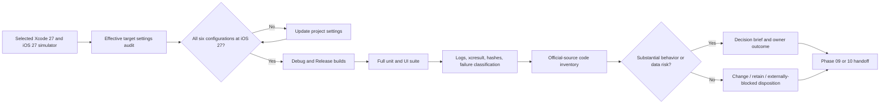

# Phase 08: iOS 27 Baseline & API Inventory — Research

<user_constraints>
## User Constraints (from CONTEXT.md)

### Locked Decisions

#### Baseline evidence
- **D-01:** Use the installed Xcode 27 toolchain and a named iOS 27 simulator as the Phase 08 baseline. Capture Debug and Release builds and the full unit and UI test suite. Real-device behavior checks belong to the later verification phase.
- **D-02:** Record the exact commands, selected Xcode and Swift compiler versions, SDK and runtime, simulator identity, dependency state, result counts, and all diagnostics. Keep a committed summary and complete raw logs for comparison.
- **D-03:** Classify any baseline failure as app-owned, test-related, or environment-related. Preserve its evidence and assign remediation to the relevant later phase; a failing baseline does not silently become a passing one or expand Phase 08 into a general bug-fix phase.

#### Inventory detail
- **D-04:** Use one entry per distinct API or implementation pattern, grouping repeated uses while listing every exact source location. Each candidate needs its change, retain, or externally-blocked disposition, official Apple or Swift source, availability, rationale, priority, and destination phase.
- **D-05:** Record an explicit no-candidate row for every reviewed production and test area, naming what was checked. Coverage includes app entry/startup, features, design system, domain, persistence, services, tests, and tooling.
- **D-06:** Retain uncertain platform workarounds pending evidence. State the behavior they protect and the iOS 27 reproduction or official guidance that would justify revisiting them. Do not classify lack of a documented replacement alone as an external block.
- **D-07:** Review Swift 6.4 capabilities and current official best practices across the codebase. Include a change candidate when the guidance is relevant and the change preserves existing behavior and data; avoid style-only churn or speculative rewrites. Phase 08 inventories and recommends these changes, with implementation routed to Phases 09 or 10 as appropriate.

#### Swift toolchain and language mode
- **D-08:** Adopt the Swift 6.4 compiler bundled with the selected Xcode 27 toolchain and record its exact version in the baseline. Keep `SWIFT_VERSION = 6.0` as Swift 6 language mode unless toolchain verification establishes a different supported setting; `6.4` is the compiler release, not a request to set `SWIFT_VERSION` to `6.4`. Check all targets and configurations for language-mode consistency and record any justified exception.

#### Substantial replacement decision gate
- **D-09:** A candidate needs a separate decision brief and owner scope discussion if it may alter user behavior, accessibility, persisted data, startup/lifecycle behavior, or system integration semantics, regardless of diff size. Routine, behavior-preserving replacements can be recommended through the inventory.
- **D-10:** Prepare a separate brief per substantial candidate; related candidates may be discussed together. Each brief includes current and proposed behavior, official source, availability, benefits, cost, alternatives, compatibility, data/accessibility risks, and a recommendation.
- **D-11:** Record the owner's outcome as approve, retain, or defer, with scope and reason. Only approved scope enters an execution plan. If a substantial candidate appears later in the milestone, pause only that affected rewrite for the same brief and discussion while unrelated approved work continues.

#### Documentation and artifacts
- **D-12:** Update `README.md` and `CLAUDE.md` as living entry points for the selected iOS 27/Xcode 27/Swift 6.4 toolchain and build/test instructions. Find and correct stale iOS 26 or Xcode guidance in all active setup, build, and test documentation. Historical plans and ADRs remain dated records.
- **D-13:** Keep the dated inventory, source links, dispositions, and decision briefs in Phase 08 planning artifacts; link durable guidance from living docs. Commit the baseline summary, exact commands, log paths, and log hashes. Keep bulky raw logs as linked local artifacts outside Git.

#### Folded Todos
- **Migrate project to iOS 27 and modernize codebase:** `.planning/todos/pending/2026-09-15-migrate-project-to-ios-27-and-modernize-codebase.md` is the originating request for the deployment-target migration, codebase-wide audit, deprecation handling, and regression verification. Phase 08 performs its baseline and inventory portion; implementation and final verification remain assigned to Phases 09–11.

### the agent's Discretion

No section with this heading exists in CONTEXT.md.

### Deferred Ideas (OUT OF SCOPE)

No new capability was added during discussion. The separately matched GSD branch-per-milestone workflow todo is outside this iOS migration; the notification cold-launch todo is already completed, and name-autocomplete scope belongs to future product work.
</user_constraints>

<phase_requirements>
## Phase Requirements

| ID | Description | Research Support |
|---|---|---|
| PLAT-01 | All app and test targets require iOS 27.0 in every relevant build configuration. | Inspect the six target/configuration combinations using source settings and effective `xcodebuild -showBuildSettings`; assert each deployment target is `27.0`. |
| PLAT-02 | Developers can build and test using the documented Xcode/iOS 27 toolchain; build scripts, resolved dependencies and living documentation match the selected baseline. | Pin the selected Xcode, SDK, runtime, simulator UDID and compiler; run Debug, Release and full suite; reconcile active documentation and dependency state. |
| MOD-01 | A complete inventory covers app entry/startup, every feature area, design system, domain, persistence, services, tests and tooling. Each deprecated API, outdated pattern and workaround candidate has a change/retain/externally-blocked disposition with exact location, official Apple source, availability and rationale; areas with no changes are recorded. | Use the coverage matrix, candidate schema, official source rules and no-candidate rows below. |
| MOD-05 | When official Apple documentation or iOS 27 diagnostics reveal a substantial API replacement or rewrite, the owner can review a concrete analysis of current and proposed behavior, benefits, costs, compatibility, data/accessibility risks, alternatives and recommended scope before that rewrite enters an execution plan; discoveries made later in the milestone return to the same discussion. | Generate one brief per substantial candidate and record owner outcome before routing approved scope onward. |
</phase_requirements>

**Researched:** 2026-09-16
**Domain:** Xcode 27 baseline capture, iOS 27 API and Swift 6.4 inventory
**Confidence:** HIGH for installed toolchain and project configuration; MEDIUM for candidate discovery until full Phase 08 scan and iOS 27 reproductions.

## Summary

Use the installed Xcode 27.0 (build `27A266a`), Apple Swift 6.4 (`swiftlang-6.4.0.34.1`), iOS SDK 27.0, and iOS 27.0 iPhone 18 Pro simulator (`1D35E1B8-4141-4EFF-A493-52CB37B600A5`) as the named evidence environment. These values were returned by `xcodebuild -version`, `xcrun swift --version`, `xcrun --sdk iphoneos --show-sdk-version`, and `xcrun simctl list`; Apple lists Xcode 27 with Swift 6.4 compiler and Swift 6 language mode. [VERIFIED: local CLI probes, 2026-09-16] [CITED: https://developer.apple.com/xcode/system-requirements]

The source project currently says `IPHONEOS_DEPLOYMENT_TARGET = 26.0;` for the app's project Debug/Release settings and both test targets' Debug/Release settings. It says `SWIFT_VERSION = 6.0;` in each target's Debug/Release settings, while app target settings also say `SWIFT_DEFAULT_ACTOR_ISOLATION = MainActor;`. These strings are quoted verbatim from the project file; effective Debug `-showBuildSettings` returned `26.0` and `6.0` for all three targets. [VERIFIED: drinkpulse.xcodeproj/project.pbxproj:283-287,346-353,405-412,436-440,465-469,480-484,495-500,512-517] [VERIFIED: local xcodebuild -showBuildSettings]

**Primary recommendation:** Plan Phase 08 as (1) target/toolchain alignment, (2) immutable baseline evidence capture, (3) full source-backed inventory, and (4) owner decision briefs; defer actual modernization edits to Phases 09–10. [VERIFIED: .planning/phases/08-ios-27-baseline-api-inventory/08-CONTEXT.md]

## Project Constraints (from CLAUDE.md)

- Consult the current focus, open questions, project/roadmap, plan index, domain/architecture and relevant ADRs before execution; resolve contradictions against current source and living docs. [VERIFIED: CLAUDE.md]
- Use official Apple documentation as the primary authority for availability, deprecation and platform behavior; consult applicable project skills. The `swiftui-expert-skill` was read for this research, but its API list is a discovery aid and does not override official iOS 27 documentation or the locked phase scope. [VERIFIED: CLAUDE.md] [VERIFIED: /Users/fempter/.agents/skills/swiftui-expert-skill/SKILL.md]
- Keep SwiftUI, `@Observable`, SwiftData, Swift Charts, Swift 6 concurrency, `NavigationStack`/`NavigationSplitView`, and lightweight environment DI. Do not introduce UIKit or a repository/DI framework for an inventory task. [VERIFIED: CLAUDE.md]
- Preserve grams of pure alcohol, existing data, versioned SwiftData schema snapshots, CloudKit-ready UUID/LWW and HealthKit sample identity. No schema edit, store reset, CloudKit activation or calculation refactor is justified by raising the target alone. [VERIFIED: CLAUDE.md]
- Preserve privacy: on-device behavior, no new network SDK/telemetry, no health data in logs, no secrets in Git, and sensitive export files outside automatic upload paths. [VERIFIED: CLAUDE.md]
- Living documentation must match changed reality; history and accepted ADRs stay dated/frozen; all new documentation and comments are English. [VERIFIED: CLAUDE.md]
- Build warnings are a quality gate, but D-03 requires a failing initial baseline to remain recorded and classified. Tests should remain green, files under 300 lines, and test placement must mirror source folders if new tests are needed. [VERIFIED: CLAUDE.md] [VERIFIED: .planning/phases/08-ios-27-baseline-api-inventory/08-CONTEXT.md]

## Architectural Responsibility Map

| Capability | Primary tier | Secondary tier | Rationale |
|---|---|---|---|
| Toolchain, deployment target and scheme | Xcode project/tooling | App/test bundles | The project defines compiler and deployment settings; effective build settings determine delivered targets. [VERIFIED: drinkpulse.xcodeproj/project.pbxproj:276-520] |
| Baseline build/test evidence | Test/tooling | Simulator | `xcodebuild` creates build/test results, while the selected runtime and destination determine execution context. [CITED: https://developer.apple.com/documentation/xcode/running-tests-and-interpreting-results] |
| API inventory and decisions | Planning documentation | All source tiers | Phase 08 reviews code but routes approved changes to Phase 09 (UI) and Phase 10 (data/platform). [VERIFIED: .planning/ROADMAP.md] |
| Persistence and identity risk | Domain/persistence | Services and tests | Existing migration and HealthKit contracts constrain future replacements. [VERIFIED: CLAUDE.md] |

## Standard Stack

| Component | Selected version/state | Purpose | Basis |
|---|---|---|---|
| Xcode | 27.0 (`27A266a`) | Build, simulator testing, xcresult evidence | Installed CLI and Apple support matrix. [VERIFIED: local xcodebuild -version] [CITED: https://developer.apple.com/xcode/system-requirements] |
| Apple Swift compiler | 6.4 (`swiftlang-6.4.0.34.1`) | Compile source | Installed `xcrun swift --version`. [VERIFIED: local CLI probe] |
| Swift language mode | Swift 6 (`SWIFT_VERSION = 6.0;`) | Existing strict language semantics | Project source and Apple support matrix distinguish compiler from language mode. [VERIFIED: drinkpulse.xcodeproj/project.pbxproj:436-440,465-469,480-484,495-500,512-517] [CITED: https://developer.apple.com/xcode/system-requirements] |
| iOS SDK/runtime | SDK 27.0; simulator runtime `iOS 27.0 (27.0 - 24A434)` | Compile and run baseline | Installed `xcrun`/`simctl`. [VERIFIED: local CLI probes] |
| Test frameworks | Swift Testing for many unit tests; XCTest/XCUITest for UI and some performance tests | Existing suite | `@Test`/`#expect` and `XCTestCase`/`XCTAssert` appear in opened test files; keep framework mix unless a concrete gain is proved. [VERIFIED: drinkpulseTests/Services/HealthWriteHooksTests.swift:32-48] [VERIFIED: drinkpulseUITests/Features/Onboarding/OnboardingFlowUITests.swift:4-33] |
| Evidence tools | `xcodebuild`, `xcresulttool`, `simctl`, `shasum` | Commands, result counts, diagnostics, hashes | Xcode bundles first three; local help verifies `xcresulttool get test-results summary --path`. [VERIFIED: local CLI help] [CITED: https://developer.apple.com/documentation/xcode/xcode-command-line-tool-reference] |

No external package install is recommended for Phase 08. The project has no `Package.resolved` in this checkout and the active README states no third-party dependencies; the executor should still capture `xcodebuild -resolvePackageDependencies` output and any subsequently generated resolution state. [VERIFIED: local file search, 2026-09-16] [VERIFIED: README.md]

## Architecture Patterns

### System architecture diagram



### Recommended artifact layout

Use the existing Phase 08 directory for a committed baseline summary, dated inventory, and decision briefs; keep raw `.log` and `.xcresult` outside Git and record their paths and SHA-256 hashes in the summary. These filenames are proposals for the planner, not existing project files: `08-BASELINE.md`, `08-INVENTORY.md`, `08-DECISION-<slug>.md`. [ASSUMED] The `.gitignore` currently ignores `*.xcresult` and `build/`; it does not substitute for the explicit out-of-Git location required by D-13. [VERIFIED: .gitignore:31-47]

### Pattern 1: Effective-settings matrix before builds

Audit app, unit tests, and UI tests in Debug and Release. The six literal `IPHONEOS_DEPLOYMENT_TARGET = 26.0;` settings are visible in the project; `SWIFT_VERSION = 6.0;` appears at target level in both configurations, and the app's deployment target is inherited from project configuration. [VERIFIED: drinkpulse.xcodeproj/project.pbxproj:283-287,346-353,405-412,436-440,465-469,480-484,495-500,512-517] Execute a post-edit effective-settings check for each target/configuration, rather than counting textual occurrences only. [CITED: https://developer.apple.com/documentation/xcode/xcode-command-line-tool-reference]

```bash
# Source: installed Xcode 27 xcodebuild -help; run after target-setting edit.
for config in Debug Release; do
  for target in drinkpulse drinkpulseTests drinkpulseUITests; do
    xcodebuild -project drinkpulse.xcodeproj -target "$target" \
      -configuration "$config" -sdk iphonesimulator \
      -showBuildSettings -json 2>"/tmp/${target}-${config}-settings.stderr" \
      | jq -r '.[] | [.target, .buildSettings.IPHONEOS_DEPLOYMENT_TARGET, .buildSettings.SWIFT_VERSION] | @tsv'
  done
done
```

### Pattern 2: Evidence capture and attribution

Set an explicit simulator destination (`platform=iOS Simulator,id=1D35E1B8-4141-4EFF-A493-52CB37B600A5`) and record its name/runtime in the manifest. Capture three separate invocations: Debug build, Release build, and full `test` using the shared scheme. The scheme's Test action includes both `drinkpulseTests` and `drinkpulseUITests` with `skipped = "NO"`; quote those values beside the source line. [VERIFIED: drinkpulse.xcodeproj/xcshareddata/xcschemes/drinkpulse.xcscheme:39-67] Use distinct `-resultBundlePath` values and preserve full stdout/stderr and exit status. Xcode's result bundle contains session results, coverage when enabled, and logs; `xcresulttool get test-results summary --path` returns machine-readable counts. [CITED: https://developer.apple.com/documentation/xcode/running-tests-and-interpreting-results] [VERIFIED: local xcresulttool help]

Before changing target settings, an optional pre-edit run can help attribute new failures, but the committed Phase 08 baseline must describe the final iOS 27 target state. Do not call a pre-edit run the completed PLAT-01 baseline. [ASSUMED]

### Pattern 3: One inventory entry per distinct pattern

Required fields: ID; reviewed area; current API/pattern; **all** `file:line` occurrences; official Apple/Swift URL and lookup date; exact availability/deprecation wording; evidence type (docs, compiler diagnostic, iOS 27 reproduction); disposition `change`, `retain`, or `externally-blocked`; rationale; behavior/data/accessibility risk; priority; destination phase; brief/outcome link if substantial. A search hit is a discovery lead, not deprecation proof. [VERIFIED: .planning/phases/08-ios-27-baseline-api-inventory/08-CONTEXT.md] [VERIFIED: CLAUDE.md]

For every reviewed area, add a no-candidate row naming files/patterns checked and source families reviewed, even if all candidate rows elsewhere cover the general framework. [VERIFIED: .planning/phases/08-ios-27-baseline-api-inventory/08-CONTEXT.md]

### Inventory coverage map for planning

| Area | Starting source surface | Required review focus |
|---|---|---|
| Entry/startup | `drinkpulse/drinkpulseApp.swift`, `Features/Shell/`, `Domain/Persistence/ContainerLoadState.swift`, `StoreBootstrap.swift` | Lifecycle, onboarding authority, container creation, notification delegate. [VERIFIED: local source search; CLAUDE.md] |
| Features | `Features/AddDrink/`, `Dashboard/`, `History/`, `Insights/`, `Onboarding/`, `Settings/`, `Shell/` | Navigation, forms, sheets, gestures, charts, accessibility, Query and task lifetimes. [VERIFIED: local file inventory] |
| Design system | `DesignSystem/`, `Diagnostics/` | Glass surfaces, materials, colors, animations, previews, instrumentation. [VERIFIED: local file inventory] |
| Domain | `Domain/` root and `Domain/DataTransfer/` | Pure-alcohol math, guidelines, export/import and Swift 6.4 standard-library relevance. [VERIFIED: local file inventory; CLAUDE.md] |
| Persistence | `Domain/Persistence/`, frozen `Schemas/SchemaV1.swift` through `SchemaV4.swift` | SwiftData availability, migration, identity, store recovery; do not mutate shipped snapshots. [VERIFIED: local file inventory; CLAUDE.md] |
| Services | `Services/` | HealthKit, UserNotifications, file operations, `@unchecked Sendable`, actor isolation, task cancellation. [VERIFIED: local source search] |
| Unit/UI tests | `drinkpulseTests/`, `drinkpulseUITests/` including all mirrored feature folders | XCTest/Swift Testing APIs, test hooks, simulator assumptions, performance and UI tests. [VERIFIED: local file inventory; CLAUDE.md] |
| Tooling/docs | `drinkpulse.xcodeproj/`, shared scheme, `README.md`, `CLAUDE.md`, active setup/build/test docs | Six target/config settings, simulator destination, dependency resolution, current commands. [VERIFIED: local source search] |

### Known review leads, not pre-decided changes

- History uses `List` in `HistoryListQueryView.swift` and a separate `ScrollView` calendar branch in `HistoryView.swift`; prior List/ScrollView and context-menu investigations document behavior-sensitive tradeoffs. Retain until a named iOS 27 reproduction and official replacement guidance justify change. [VERIFIED: drinkpulse/Features/History/HistoryListQueryView.swift:39] [VERIFIED: drinkpulse/Features/History/HistoryView.swift:147] [VERIFIED: .planning/debug/resolved/history-scrollview-bugs.md] [VERIFIED: .planning/debug/resolved/contextmenu-zoom-glitch.md]
- `NotificationScheduling.swift` contains `extension UNUserNotificationCenter: @retroactive @unchecked Sendable {}` and `NotificationActionHandler.swift` has `@unchecked Sendable`. These are high-priority review leads for Swift 6.4 concurrency guidance, but removing either without an isolation/lifecycle proof would be speculative. [VERIFIED: drinkpulse/Services/NotificationScheduling.swift:11] [VERIFIED: drinkpulse/Services/NotificationActionHandler.swift:4] [CITED: https://www.swift.org/migration/documentation/swift-6-concurrency-migration-guide/dataracesafety/]
- Swift 6.4 adds async `defer`, `withTaskCancellationShield`, Observation change notifications, and XCTest/Swift Testing interoperability. Review only call sites where they solve a concrete cleanup, cancellation, observation or test problem; no broad style migration is justified by release age. [CITED: https://www.swift.org/blog/swift-6.4-released/]
- Xcode 27's test release notes announce `XCUIVoiceOverService`; inventory it as a possible Phase 11 accessibility-test follow-up after API documentation/availability are checked, not as an automatic Phase 08 test rewrite. [CITED: https://developer.apple.com/documentation/xcode-release-notes/xcode-27-release-notes]

## Don't Hand-Roll

| Problem | Use instead | Why |
|---|---|---|
| Test results and diagnostics parsing | `xcresulttool` and preserved `.xcresult` | Xcode already records structured result bundles; console regex alone can miss failures/skips. [CITED: https://developer.apple.com/documentation/xcode/running-tests-and-interpreting-results] |
| Platform API availability/deprecation claims | Apple symbol docs, iOS/Xcode release notes, Swift.org evolution/release docs, compiler diagnostics | API age and a third-party migration list do not prove a deprecation or replacement. [VERIFIED: CLAUDE.md] |
| SwiftData migration | `VersionedSchema` plus `SchemaMigrationPlan`/`MigrationStage` | Existing shipped snapshots and store integrity require explicit versioning if future model shape changes. [CITED: https://developer.apple.com/documentation/swiftdata/versionedschema] [VERIFIED: CLAUDE.md] |
| Reproducing History workaround behavior by inspection | Existing UI tests and named iOS 27 simulator | Framework rendering/gesture behavior requires observed evidence. [VERIFIED: .planning/debug/resolved/contextmenu-zoom-glitch.md] |

## Code Examples

### Baseline capture skeleton

The following is a **planning skeleton**; choose and create the outside-Git artifact directory before running it. `-resultBundlePath` and `xcresulttool` are Xcode-supported tools; preserve separate complete output streams and exit codes in the final script. [CITED: https://developer.apple.com/documentation/xcode/running-tests-and-interpreting-results] [VERIFIED: local xcodebuild/xcresulttool help]

```bash
# Source: Xcode 27 local help and Apple's Xcode test documentation.
artifact_dir="$HOME/Library/Logs/DrinkPulse/phase-08-$(date +%Y%m%d-%H%M%S)"
mkdir -p "$artifact_dir"
destination='platform=iOS Simulator,id=1D35E1B8-4141-4EFF-A493-52CB37B600A5'
for config in Debug Release; do
  xcodebuild -project drinkpulse.xcodeproj -scheme drinkpulse \
    -configuration "$config" -destination "$destination" \
    -resultBundlePath "$artifact_dir/build-${config}.xcresult" build \
    >"$artifact_dir/build-${config}.stdout.log" \
    2>"$artifact_dir/build-${config}.stderr.log"
  printf '%s\n' "$?" >"$artifact_dir/build-${config}.exit"
done
xcodebuild -project drinkpulse.xcodeproj -scheme drinkpulse \
  -configuration Debug -destination "$destination" \
  -resultBundlePath "$artifact_dir/full-test.xcresult" test \
  >"$artifact_dir/full-test.stdout.log" \
  2>"$artifact_dir/full-test.stderr.log"
printf '%s\n' "$?" >"$artifact_dir/full-test.exit"
xcrun xcresulttool get test-results summary \
  --path "$artifact_dir/full-test.xcresult" \
  >"$artifact_dir/full-test-summary.json"
shasum -a 256 "$artifact_dir"/*.log "$artifact_dir"/*.json
```

The selected UDID is an observed local simulator identity, not a repo constant. Re-probe at execution and replace it if Xcode recreates the device. [VERIFIED: local simctl list, 2026-09-16] The planner should decide whether simulator signing needs an explicit `CODE_SIGNING_ALLOWED=NO` based on a first build failure; project history records an iCloud-synced DerivedData signing issue, so do not apply that flag silently to every run. [VERIFIED: docs/DEVLOG.md]

### Inventory and decision rows

```markdown
| ID | Area | API or pattern | All exact locations | Official source + checked date | Availability/deprecation | Evidence | Disposition | Reason | Priority | Phase | Brief/outcome |
|---|---|---|---|---|---|---|---|---|---|---|---|
| C-001 | History | example only | file:line; file:line | Apple symbol URL; 2026-09-16 | exact documentation statement | docs + iOS 27 repro | retain | protected behavior | P1 | 09 | — |
| N-001 | reviewed area | no candidate | files checked | Apple release/symbol docs | — | review checklist | retain | what was checked | — | — | — |
```

Use actual source paths and verified API wording when populating rows; the placeholders above make no factual candidate claim. A substantial candidate gets a separate brief before any downstream execution plan includes it. [VERIFIED: .planning/phases/08-ios-27-baseline-api-inventory/08-CONTEXT.md]

## Runtime State Inventory

Deployment migration can affect runtime state even when Phase 08 edits only project metadata. The planner should record these five categories in the baseline. No source-string rename is proposed. [VERIFIED: .planning/phases/08-ios-27-baseline-api-inventory/08-CONTEXT.md]

| Category | Known state / check | Action required |
|---|---|---|
| Stored data | SwiftData stores and frozen schema versions exist in app architecture; user-device contents cannot be inventoried from this checkout. [VERIFIED: drinkpulse/Domain/Persistence/MigrationPlan.swift:7-58] | No Phase 08 data migration. Record that Phase 10 must verify existing-store upgrade; never reset data as a baseline shortcut. [VERIFIED: CLAUDE.md] |
| Live service config | HealthKit and notification permissions/schedules can exist in simulator/device state; CloudKit activation remains outside milestone. [VERIFIED: drinkpulse/Services/HealthService.swift:24-78] [VERIFIED: drinkpulse/Services/ReminderService.swift:26] [VERIFIED: .planning/REQUIREMENTS.md] | Keep simulator identity and test seeding/reset state documented; Phase 10 handles behavior checks. |
| OS-registered state | Notification registrations are managed by iOS, not project settings. [VERIFIED: drinkpulse/Services/ReminderService.swift:26] | Inventory schedule/tap routing test coverage; no unverified claim that raising minimum removes registrations. |
| Secrets/env vars | Signing team and entitlements are project settings; no secret values were read. [VERIFIED: drinkpulse.xcodeproj/project.pbxproj:425-440] | Record signing mode and `CODE_SIGNING_ALLOWED` used for simulator builds; do not place credentials in logs or committed artifacts. [VERIFIED: CLAUDE.md] |
| Build artifacts | `build/` and `*.xcresult` are ignored locally; existing DerivedData can influence repeatability. [VERIFIED: .gitignore:31-47] | Use explicit, outside-Git result/log paths and record them; preserve full evidence. |

## Common Pitfalls

1. **Compiler release confused with language mode.** `SWIFT_VERSION = 6.4` is not the selected Swift 6 mode. Keep `SWIFT_VERSION = 6.0;` unless Xcode itself proves another supported setting. Warning sign: one target/config differs in effective settings. [VERIFIED: drinkpulse.xcodeproj/project.pbxproj:436-440,465-469,480-484,495-500,512-517] [CITED: https://developer.apple.com/xcode/system-requirements]
2. **A green scheme result hides incomplete scope.** Verify both testables and parsed result counts, including skips; do not infer full coverage from a success banner. [VERIFIED: drinkpulse.xcodeproj/xcshareddata/xcschemes/drinkpulse.xcscheme:39-67] [CITED: https://developer.apple.com/documentation/xcode/running-tests-and-interpreting-results]
3. **Simulator contention or stale destination.** The active README/CLAUDE examples name `iPhone 17 Pro`, while local `simctl` lists `iPhone 18 Pro` on iOS 27. Use a named UDID and do not manually operate the simulator during the full UI suite; prior project logs document contention. [VERIFIED: README.md:119-129] [VERIFIED: CLAUDE.md:522-534] [VERIFIED: local simctl list] [VERIFIED: docs/DEVLOG.md]
4. **History workaround removed because it looks old.** Prior geometry/context-menu investigations show behavior depends on row grouping and Liquid Glass. Preserve workaround until iOS 27 observation and official docs support a specific replacement. [VERIFIED: .planning/debug/resolved/history-scrollview-bugs.md] [VERIFIED: .planning/debug/resolved/contextmenu-zoom-glitch.md]
5. **Readme-only documentation update.** `README.md` still claims `Xcode 16 or later` and `macOS Sequoia` and names an iPhone 17 Pro destination; `CLAUDE.md` also contains old deployment/destination text. The living `.planning/PROJECT.md` says `minimum deployment iOS 26` in present-tense fields, while `.claude/context/current-focus.md` still says Phase 07 is awaiting next-milestone scoping. Update those current-state claims to match Phase 08 reality, while preserving dated history. `docs/architecture.md` mentions the iOS 26 introduction of the tab bar; clarify only if it reads as a current minimum. [VERIFIED: README.md:6,116-129] [VERIFIED: CLAUDE.md:10,36,522-534] [VERIFIED: .planning/PROJECT.md:5-10,325-332] [VERIFIED: .claude/context/current-focus.md:5-11] [VERIFIED: docs/architecture.md:86-87]
6. **Inventory treats a missing replacement as external block.** `externally-blocked` needs affirmative Apple evidence of a blocker; uncertainty means retain and state the needed iOS 27 proof. [VERIFIED: .planning/phases/08-ios-27-baseline-api-inventory/08-CONTEXT.md]
7. **Raw logs leak personal data.** Capture build/test diagnostics and hashes without logging health fields or exporting user data; use synthetic test data. [VERIFIED: CLAUDE.md]

## State of the Art

| Prior project state | Selected Phase 08 state | Basis |
|---|---|---|
| iOS 26 minimum and iPhone 17 Pro examples | iOS 27 minimum in six target/config combinations; named iOS 27 iPhone 18 Pro simulator | Locked D-01/D-08/D-12, current project/README, local simulator inventory. [VERIFIED: drinkpulse.xcodeproj/project.pbxproj:283-517] [VERIFIED: README.md:6,119-129] [VERIFIED: local simctl list] |
| Swift 6 mode under older compiler | Swift 6 mode under bundled Swift 6.4 compiler | Apple explicitly lists compiler Swift 6.4 and language mode Swift 6 separately. [CITED: https://developer.apple.com/xcode/system-requirements] |
| Mixed Swift Testing/XCTest project | Retain mixed suite; use interoperability only where needed | Swift 6.4 release includes interoperability, while project UI tests remain XCTest-based. [CITED: https://www.swift.org/blog/swift-6.4-released/] [VERIFIED: drinkpulseUITests/Features/Onboarding/OnboardingFlowUITests.swift:4-33] |

## Assumptions Log

| # | Claim | Section | Risk if wrong |
|---|---|---|---|
| A1 | Suggested artifact filenames and location outside Git are planning proposals, not established repository conventions. | Architecture Patterns | Planner must choose paths and ensure local artifact retention. |
| A2 | A pre-edit run may be useful for attribution, but final target-state evidence is the required baseline. | Architecture Patterns | Extra run costs time; omit if not useful. |
| A3 | No new external package is necessary; current checkout has no `Package.resolved`, but future resolution state must be recorded. | Standard Stack | Unexpected package dependencies would require legitimacy and lockfile review. |

## Open Questions

1. **What failures or warnings appear in the actual iOS 27 Debug/Release/full-suite runs?** The answer requires Phase 08 execution, not inference from source. Preserve each diagnostic and classify it under D-03.
2. **Which exact API uses are deprecated or genuinely improved by iOS 27/Swift 6.4?** Full-file review, Apple symbol lookup, and baseline diagnostics are Phase 08 deliverables. Do not pre-authorize replacements from this research.
3. **Which substantial candidates need an owner decision before Phases 09–10?** Generate briefs only after discovery; keep affected rewrites out of execution plans until an approve/retain/defer outcome is recorded.

## Environment Availability

| Dependency | Required by | Available | Exact observed state | Fallback |
|---|---|---|---|---|
| Xcode / `xcodebuild` | All requirements | Yes | 27.0, build `27A266a` [VERIFIED: local CLI] | None needed |
| Apple Swift / iOS SDK | Build and API inventory | Yes | Swift 6.4 (`swiftlang-6.4.0.34.1`), iOS SDK 27.0 [VERIFIED: local CLI] | None needed |
| iOS Simulator / `simctl` | Baseline tests | Yes | iPhone 18 Pro UDID `1D35E1B8-4141-4EFF-A493-52CB37B600A5`, iOS 27.0 runtime build `24A434` [VERIFIED: local CLI] | Reselect a named iOS 27 device and record it if unavailable at execution |
| `xcresulttool` | Structured test counts | Yes | `get test-results summary --path` confirmed by local help [VERIFIED: local CLI] | Xcode report navigator |
| `jq` | Suggested settings matrix | Yes | Executed successfully in this research [VERIFIED: local CLI] | `python3` JSON parsing |
| Context7/`ctx7` | Documentation seam | No callable Context7 MCP/CLI in this agent | `command -v ctx7` returned none [VERIFIED: local CLI] | Official Apple/Swift web docs and Apple `.md` pages |

**Missing dependencies with no fallback:** None for Phase 08. [VERIFIED: local environment probes]

## Validation Architecture

`workflow.nyquist_validation` is `true`. [VERIFIED: .planning/config.json]

| Property | Value |
|---|---|
| Framework | Existing Swift Testing plus XCTest/XCUITest under Xcode 27; no framework install. [VERIFIED: drinkpulseTests/Services/HealthWriteHooksTests.swift:32-48] [VERIFIED: drinkpulseUITests/Features/Onboarding/OnboardingFlowUITests.swift:4-33] |
| Config | Shared `drinkpulse` scheme with unit and UI testables. [VERIFIED: drinkpulse.xcodeproj/xcshareddata/xcschemes/drinkpulse.xcscheme:39-67] |
| Fast check | Effective-settings matrix command above (seconds on this machine). [VERIFIED: local xcodebuild probe] |
| Full suite | `xcodebuild -project drinkpulse.xcodeproj -scheme drinkpulse -configuration Debug -destination 'platform=iOS Simulator,id=1D35E1B8-4141-4EFF-A493-52CB37B600A5' -resultBundlePath <outside-git-path>.xcresult test` [CITED: https://developer.apple.com/documentation/xcode/running-tests-and-interpreting-results] |

| Req ID | Behavior | Verification | Wave 0 gap |
|---|---|---|---|
| PLAT-01 | All three targets in Debug/Release resolve to iOS 27.0 and Swift 6 mode | Six `-showBuildSettings -json` checks; inspect generated app/test bundle minimum OS if useful | Add a small repeatable command/script or committed command transcript; no new test framework. |
| PLAT-02 | Selected Xcode can build Debug/Release and full suite; docs/dependencies agree | Two `xcodebuild build` results, one full `xcodebuild test` `.xcresult`; hash logs; review active docs and dependency resolution | Baseline manifest template and external raw-log directory. |
| MOD-01 | Every code/test/tooling area reviewed; candidate and no-candidate rows complete | Coverage matrix against `rg --files`; source links and location audit; manual review of each row | Inventory template and review checklist. |
| MOD-05 | Every substantial candidate has brief and recorded owner outcome before execution | Brief-to-inventory cross-reference audit; owner discussion checkpoint only for discovered substantial candidates | Decision-brief template and outcome ledger. |

**Sampling:** Run settings matrix after project edits; capture the full suite once for the Phase 08 baseline; inspect each inventory batch against the coverage list; at phase gate require all artifacts and unresolved diagnostics classified. Do not re-run the 25-minute suite solely for documentation edits. [VERIFIED: CLAUDE.md] The full suite is explicitly required by D-01 even if baseline failures remain; report counts and failure classes exactly. [VERIFIED: .planning/phases/08-ios-27-baseline-api-inventory/08-CONTEXT.md]

## Security Domain

`security_enforcement` is enabled. This phase handles local health-app code and test artifacts, not a server boundary. [VERIFIED: .planning/config.json] [VERIFIED: CLAUDE.md]

| ASVS category | Applies | Phase control |
|---|---|---|
| V2 Authentication | No new auth flow | Preserve on-device/no-account design. [VERIFIED: CLAUDE.md] |
| V3 Session Management | No web session | Do not introduce one. [VERIFIED: CLAUDE.md] |
| V4 Access Control | Yes, HealthKit/system permissions in later phase | Inventory permission-handling call sites and route behavior changes to Phase 10. [VERIFIED: drinkpulse/Services/HealthService.swift:24-78] |
| V5 Input Validation | Yes, existing import/model data | Inventory changes without altering parser or validation behavior in Phase 08. [VERIFIED: drinkpulse/Domain/DataTransfer/DataImporter.swift:1-2] |
| V6 Cryptography | No new cryptographic operation | Use system file protection and hashes only for artifact integrity; do not hand-roll encryption. [VERIFIED: CLAUDE.md] |

Threat pattern: an unreviewed log or `.xcresult` attachment could contain health or personal data; use synthetic test fixtures, inspect artifacts before sharing, and keep bulky raw evidence outside Git. [VERIFIED: CLAUDE.md]

## Sources

### Primary and direct evidence

- Apple [Xcode 27 release notes](https://developer.apple.com/documentation/xcode-release-notes/xcode-27-release-notes) — selected toolchain, compiler changes, testing features; checked 2026-09-16.
- Apple [Xcode SDK/system requirements](https://developer.apple.com/xcode/system-requirements) — Swift compiler/language-mode separation, iOS 27 SDK/runtime and host requirements; checked 2026-09-16.
- Apple [iOS/iPadOS 27 release notes](https://developer.apple.com/documentation/ios-ipados-release-notes/ios-ipados-27-release-notes) — platform-change inventory starting point; checked 2026-09-16.
- Apple [Running tests and interpreting results](https://developer.apple.com/documentation/xcode/running-tests-and-interpreting-results), [command-line tool reference](https://developer.apple.com/documentation/xcode/xcode-command-line-tool-reference) — `.xcresult` and `xcresulttool`; checked 2026-09-16.
- Swift.org [Swift 6.4 Released](https://www.swift.org/blog/swift-6.4-released/) and [Data Race Safety](https://www.swift.org/migration/documentation/swift-6-concurrency-migration-guide/dataracesafety/) — language, library, testing and concurrency candidates; checked 2026-09-16.
- Apple [VersionedSchema](https://developer.apple.com/documentation/swiftdata/versionedschema) and [contextMenu preview](https://developer.apple.com/documentation/swiftui/view/contextmenu%28menuitems%3Apreview%3A%29) — specific future candidate verification leads; checked 2026-09-16.
- Local installed `xcodebuild`, `swift`, `simctl`, `xcresulttool`, project configuration and shared scheme probes — exact environment evidence captured during this research.

### Project sources

- `08-CONTEXT.md`, `.planning/REQUIREMENTS.md`, `.planning/ROADMAP.md`, `.planning/PROJECT.md`, `CLAUDE.md`, `README.md`, project file, shared scheme, and resolved debug reports.
- The knowledge graph was 721 hours old and 13 commits behind when checked; three discovery queries returned no nodes. It was not used as authoritative evidence. [VERIFIED: local graphify status/query]

## Metadata

**Confidence breakdown:** Standard stack HIGH (installed CLI plus Apple support matrix); architecture HIGH (current project and locked context); candidate leads MEDIUM (source matches and official release notes, pending full inventory and iOS 27 behavior). Source tiers were queried through `gsd-tools classify-confidence`: official web findings cross-checked locally are MEDIUM via this seam; local project/tool probes are direct verification.
**Research date:** 2026-09-16
**Valid until:** 2026-09-23 for toolchain/API release details; recheck Apple release notes at execution.
